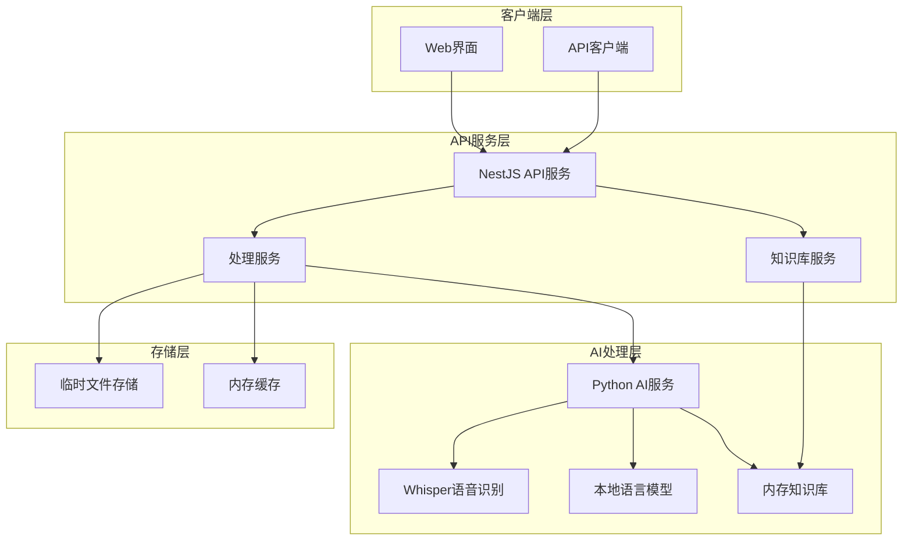

# 设计文档

## 概述

语音AI决策系统是一个轻量级的智能语音处理平台，支持语音文件和文本输入，通过本地部署的轻量级AI模型进行内容理解和智能决策。系统采用简化架构，使用同步处理和内存存储，专注于快速验证功能可行性。

## 架构

### 整体架构图



### 技术栈选择

- **API层**: NestJS + TypeScript + Express
- **AI处理**: Python + FastAPI + Transformers
- **存储**: 内存存储 + 临时文件系统
- **容器化**: Docker + Docker Compose
- **语音识别**: Whisper-base (OpenAI)
- **语言模型**: Qwen2-1.5B 或 ChatGLM3-6B
- **知识库**: 简单文本匹配（内存存储）

## 组件和接口

### 1. NestJS API 服务

#### 核心模块

```typescript
// 处理模块
@Module({
  imports: [MulterModule],
  controllers: [ProcessController],
  providers: [ProcessService, AIClientService]
})
export class ProcessModule {}

// 知识库模块
@Module({
  controllers: [KnowledgeController],
  providers: [KnowledgeService, MemoryStorageService]
})
export class KnowledgeModule {}

// 健康检查模块
@Module({
  controllers: [HealthController],
  providers: [HealthService]
})
export class HealthModule {}
```

#### 主要接口

```typescript
// 简化的处理请求接口
interface ProcessRequest {
  type: 'voice' | 'text';
  content: string | Buffer;
  metadata?: {
    filename?: string;
    format?: string;
  };
}

// 直接返回的处理结果接口
interface ProcessResult {
  success: boolean;
  transcription?: string;
  understanding: {
    intent: string;
    entities: any[];
    confidence: number;
  };
  actions: Action[];
  processingTime: number;
  timestamp: Date;
}
```

### 2. Python AI 服务

#### 服务架构

```python
# FastAPI 应用结构
from fastapi import FastAPI
from services.whisper_service import WhisperService
from services.llm_service import LLMService
from services.knowledge_service import MemoryKnowledgeService

app = FastAPI()

# 服务初始化
whisper_service = WhisperService(model_name="whisper-base")
llm_service = LLMService(model_name="Qwen/Qwen2-1.5B-Instruct")
knowledge_service = MemoryKnowledgeService()
```

#### 核心服务类

```python
class AIProcessingService:
    def __init__(self):
        self.whisper = WhisperService()
        self.llm = LLMService()
        self.knowledge = MemoryKnowledgeService()
    
    async def process_voice(self, audio_data: bytes) -> dict:
        # 语音转文本
        transcription = await self.whisper.transcribe(audio_data)
        # 内容理解
        understanding = await self.llm.understand(transcription)
        # 简单知识库查询
        context = self.knowledge.search(understanding.get('query', ''))
        # 决策生成
        decision = await self.llm.decide(understanding, context)
        return decision
    
    async def process_text(self, text: str) -> dict:
        # 直接进行内容理解
        understanding = await self.llm.understand(text)
        context = self.knowledge.search(understanding.get('query', ''))
        decision = await self.llm.decide(understanding, context)
        return decision
```

### 3. 内存存储和缓存

#### 内存数据结构

```typescript
// 简单的内存缓存
class MemoryCache {
  private cache = new Map<string, any>();
  
  set(key: string, value: any, ttl?: number): void {
    this.cache.set(key, {
      value,
      expires: ttl ? Date.now() + ttl * 1000 : null
    });
  }
  
  get(key: string): any {
    const item = this.cache.get(key);
    if (!item) return null;
    
    if (item.expires && Date.now() > item.expires) {
      this.cache.delete(key);
      return null;
    }
    
    return item.value;
  }
}
```

#### 知识库存储

```python
# 简单的内存知识库
class MemoryKnowledgeService:
    def __init__(self):
        self.documents = []
        self.index = {}
    
    def add_document(self, title: str, content: str):
        doc_id = len(self.documents)
        self.documents.append({
            'id': doc_id,
            'title': title,
            'content': content
        })
        
        # 简单的关键词索引
        words = content.lower().split()
        for word in words:
            if word not in self.index:
                self.index[word] = []
            self.index[word].append(doc_id)
    
    def search(self, query: str) -> list:
        words = query.lower().split()
        relevant_docs = []
        
        for word in words:
            if word in self.index:
                for doc_id in self.index[word]:
                    if doc_id not in [d['id'] for d in relevant_docs]:
                        relevant_docs.append(self.documents[doc_id])
        
        return relevant_docs[:3]  # 返回前3个相关文档
```

## 数据模型

### 内存数据结构

```typescript
// 处理请求数据结构
interface ProcessingRequest {
  id: string;
  type: 'voice' | 'text';
  content: string | Buffer;
  timestamp: Date;
  metadata?: {
    filename?: string;
    format?: string;
  };
}

// 处理结果数据结构
interface ProcessingResult {
  id: string;
  success: boolean;
  transcription?: string;
  understanding: {
    intent: string;
    entities: any[];
    confidence: number;
  };
  actions: Action[];
  processingTime: number;
  timestamp: Date;
  error?: string;
}
```

### 知识库数据结构

```python
# 知识库文档结构
@dataclass
class KnowledgeDocument:
    id: int
    title: str
    content: str
    keywords: List[str]
    created_at: datetime
    
# 搜索结果结构
@dataclass
class SearchResult:
    document: KnowledgeDocument
    relevance_score: float
    matched_keywords: List[str]
```

## 错误处理

### 错误分类和处理策略

```typescript
enum ErrorType {
  VALIDATION_ERROR = 'VALIDATION_ERROR',
  FILE_FORMAT_ERROR = 'FILE_FORMAT_ERROR',
  MODEL_PROCESSING_ERROR = 'MODEL_PROCESSING_ERROR',
  AI_SERVICE_ERROR = 'AI_SERVICE_ERROR',
  SYSTEM_ERROR = 'SYSTEM_ERROR'
}

class ErrorHandler {
  static handle(error: Error, type: ErrorType): ErrorResponse {
    switch (type) {
      case ErrorType.VALIDATION_ERROR:
        return {
          code: 400,
          message: error.message,
          retry: false
        };
      case ErrorType.MODEL_PROCESSING_ERROR:
        return {
          code: 500,
          message: '模型处理失败',
          retry: true,
          retryAfter: 30
        };
      case ErrorType.AI_SERVICE_ERROR:
        return {
          code: 503,
          message: 'AI服务暂时不可用',
          retry: true,
          retryAfter: 10
        };
      default:
        return {
          code: 500,
          message: '系统内部错误',
          retry: false
        };
    }
  }
}
```

### 重试机制

```python
# Python 服务重试配置
RETRY_CONFIG = {
    'max_retries': 3,
    'backoff_factor': 2,
    'retry_on_exceptions': [
        'ModelLoadError',
        'NetworkError',
        'TemporaryProcessingError'
    ]
}

@retry(**RETRY_CONFIG)
async def process_with_retry(task_data):
    # 处理逻辑
    pass
```

## 测试策略

### 单元测试

```typescript
// NestJS 服务测试
describe('UploadService', () => {
  let service: UploadService;
  
  beforeEach(async () => {
    const module = await Test.createTestingModule({
      providers: [UploadService, MockKafkaService]
    }).compile();
    
    service = module.get<UploadService>(UploadService);
  });
  
  it('should process voice file upload', async () => {
    const mockFile = createMockAudioFile();
    const result = await service.processVoiceUpload(mockFile);
    expect(result.taskId).toBeDefined();
  });
});
```

### 集成测试

```python
# Python AI 服务集成测试
import pytest
from services.ai_processing_service import AIProcessingService

@pytest.mark.asyncio
async def test_voice_processing_pipeline():
    service = AIProcessingService()
    
    # 测试语音处理完整流程
    audio_data = load_test_audio()
    result = await service.process_voice(audio_data)
    
    assert result['transcription'] is not None
    assert result['understanding']['intent'] is not None
    assert len(result['actions']) > 0
```

### 性能测试

```javascript
// 使用 Artillery 进行负载测试
module.exports = {
  config: {
    target: 'http://localhost:3000',
    phases: [
      { duration: '2m', arrivalRate: 10 },
      { duration: '5m', arrivalRate: 50 },
      { duration: '2m', arrivalRate: 100 }
    ]
  },
  scenarios: [
    {
      name: 'Voice upload test',
      weight: 70,
      flow: [
        {
          post: {
            url: '/api/upload/voice',
            formData: {
              file: '@test-audio.wav'
            }
          }
        }
      ]
    }
  ]
};
```

## 部署配置

### Docker Compose 配置

```yaml
version: '3.8'

services:
  # NestJS API 服务
  api-service:
    build: ./api
    ports:
      - "3000:3000"
    environment:
      - NODE_ENV=development
      - AI_SERVICE_URL=http://ai-service:8000
    depends_on:
      - ai-service
    volumes:
      - ./uploads:/app/uploads
    restart: unless-stopped

  # Python AI 服务
  ai-service:
    build: ./ai-service
    ports:
      - "8000:8000"
    environment:
      - MODEL_PATH=/app/models
    volumes:
      - ./models:/app/models
      - ./knowledge:/app/knowledge
    restart: unless-stopped
    deploy:
      resources:
        limits:
          memory: 4G
        reservations:
          memory: 2G
```

### 健康检查配置

```typescript
// NestJS 健康检查
@Controller('health')
export class HealthController {
  constructor(
    private readonly healthCheckService: HealthCheckService,
    private readonly aiClientService: AIClientService,
  ) {}

  @Get()
  @HealthCheck()
  check() {
    return this.healthCheckService.check([
      () => this.checkAIServiceConnection(),
      () => this.checkSystemMemory(),
      () => this.checkModelStatus(),
    ]);
  }

  private async checkAIServiceConnection() {
    try {
      const response = await this.aiClientService.ping();
      return { status: 'up', details: response };
    } catch (error) {
      return { status: 'down', details: error.message };
    }
  }

  private checkSystemMemory() {
    const memUsage = process.memoryUsage();
    const isHealthy = memUsage.heapUsed < memUsage.heapTotal * 0.9;
    return {
      status: isHealthy ? 'up' : 'down',
      details: { memoryUsage: memUsage }
    };
  }
}
```

这个设计文档提供了完整的系统架构，支持敏捷开发需求，使用轻量级模型，并且具有良好的扩展性。系统采用微服务架构，各组件松耦合，便于独立开发和部署。